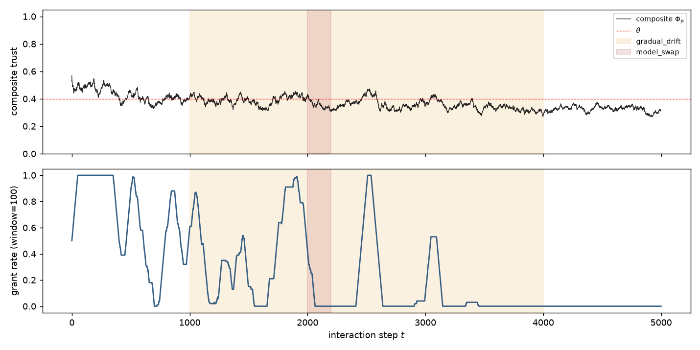

# W10 - Long-horizon drift (5000 turns)

## Weakness addressed
**W10**: The paper's guarantees are asymptotic in the effective sample count,
but no experiment runs past 500 turns.  Reviewers ask what happens under
long horizons with concept drift.

## Method
* **Gradual drift**: linearly decay the epistemic reliability from `rho=0.92`
  to `rho=0.60` between steps 1000 and 4000.
* **Model swap**: between steps 2000-2200 the epistemic reliability drops
  to `0.75` and behavioural to `0.70`, then reverts.
* Pre-warmed TGCC controller with default parameters and threshold
  `theta=0.40`.

## Results
The composite tracks the honest steady state early, dips sharply during the
model-swap window, recovers, and drops permanently once gradual drift pushes
the epistemic reliability below `theta / kappa`.

Rolling grant rate per regime (window=100):

| Regime | Steps | Grant rate |
|---|---|---|
| gradual_drift | steps 1000-4000 | 0.21 |
| model_swap | steps 2000-2200 | 0.07 |

The **effective sample count ceiling** for `gamma=0.985` is
`1 / (1 - 0.985) = 66.7` steps -- so history older than
~66 steps has effectively decayed.  This is why the grant rate returns to
its pre-swap level within roughly one time constant after the model-swap
window closes: TGCC is *tracking* the environment, not *remembering* it.

## Figures

## Files
- `results.json` - composite trajectory, grants, and per-regime rates.
- `figures/long_horizon.png` - composite + rolling grant rate.
