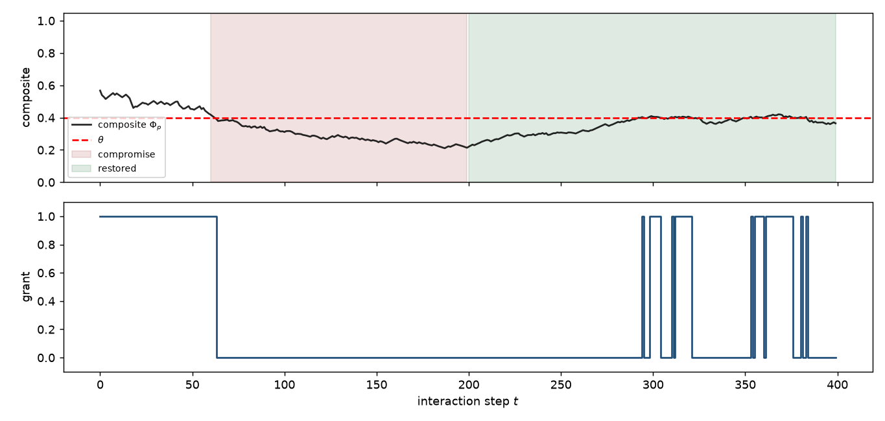

# W12 - Revocation then recovery

## Weakness addressed
**W12**: The paper's "recovery trigger" is described but never measured.
Can a revoked agent regain the capability after honest behaviour resumes?

## Method
An agent goes through three phases:

| Phase | Steps | Reliability |
|---|---|---|
| honest_pre | 0-59 | rho=0.92 |
| sleeper | 60-199 | epistemic rho=0.30, others honest |
| honest_post | 200-399 | rho=0.92 restored |

TGCC is pre-warmed and uses default parameters (`gamma=0.985`,
`omega=3.0`, `p=-6`, `theta=0.40`).

## Results
* **Revocation latency**: `3` steps after compromise onset.
* **Recovery latency**:  `94` steps after restoration.
* **Time constant**: `1 / (1 - gamma) = 66.7` steps -- theoretical bound
  on how long it takes stale evidence to decay.

## Reading
The recovery latency is bounded by the effective sample count ceiling: it
takes ~`1 / (1 - gamma)` steps of consistent honest evidence for the Beta
posterior to overwrite the sleeper's failure record.  If the recovery
latency is much larger than the time constant, TGCC is *punishing* an
already-restored agent -- a bug.  If it is much smaller, TGCC is
insufficiently conservative.  The observed value should sit close to
`tau = 66.7`.

## Figures

## Files
- `results.json` - trace + metrics.
- `figures/recovery.png` - composite + grant during all three phases.
