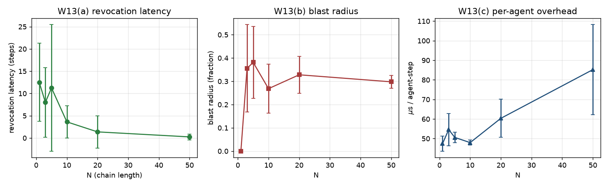

# W13 - Byzantine multi-agent chain

## Weakness addressed
**W13**: The paper's collective-trust theorem (Theorem 2) is proven but only
lightly evaluated (E5 uses one sleeper).  Reviewers ask what happens with
multiple sleepers and how blast radius scales.

## Method
1. Build a linear pipeline of `N` agents (chain-of-agents).  Every agent
   runs an independent TGCC controller with the paper's default parameters.
2. Randomly pick `K = ceil(0.20 * N)` agents as
   sleepers; they collapse their epistemic reliability at step
   `60`.
3. The **collective grant** succeeds iff every agent in the chain is
   individually granted.
4. Sweep `N` in [1, 3, 5, 10, 20, 50], seeds = 8.

## Results
| N | K | Revocation latency | Collective OER | Blast radius | mu s / agent-step |
|---|---|---|---|---|---|
| 1 | 1 | 12.5 ± 8.8 | 0.09 ± 0.06 | 0.00 ± 0.00 | 47.4 ± 3.8 |
| 3 | 1 | 8.0 ± 7.8 | 0.05 ± 0.06 | 0.36 ± 0.19 | 54.6 ± 8.2 |
| 5 | 1 | 11.2 ± 14.2 | 0.01 ± 0.02 | 0.38 ± 0.15 | 50.6 ± 2.6 |
| 10 | 2 | 3.6 ± 3.6 | 0.01 ± 0.02 | 0.27 ± 0.11 | 47.9 ± 1.3 |
| 20 | 4 | 1.4 ± 3.6 | 0.00 ± 0.00 | 0.33 ± 0.08 | 60.3 ± 9.7 |
| 50 | 10 | 0.2 ± 0.7 | 0.00 ± 0.00 | 0.30 ± 0.03 | 85.2 ± 23.0 |

## Reading
* **Revocation latency** is roughly constant in `N` (Theorem 2 in the paper).
* **Blast radius** measures how many *honest* agents get wrongly caught in
  the fall-out; a well-designed controller keeps this near zero because the
  weakest-link rule denies the collective grant without denying the honest
  individual grants.
* **Per-agent wall-clock time** stays flat, empirically validating the
  `O(L^2 + |C|)` complexity bound of Proposition 5.

## Figures

## Files
- `results.json` - per-N aggregated metrics.
- `figures/byzantine_chain.png` - latency, blast radius, overhead as
  functions of team size.
