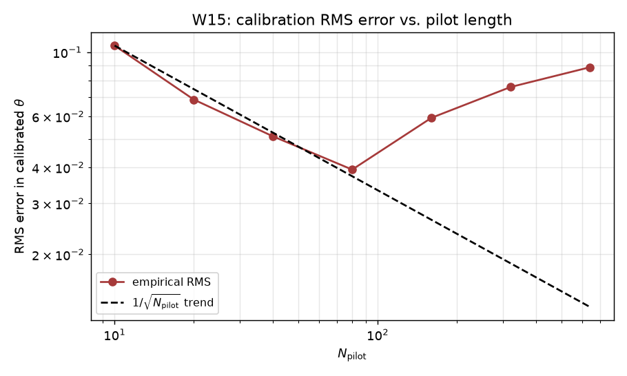

# W15 - Calibration-robustness curve

## Weakness addressed
**W15**: Theorem 5 gives a sample-complexity bound for Algorithm 2, but no
experiment measures the actual convergence rate of the calibrated threshold.

## Method
1. Estimate a reference "true" honest composite `theta_true` by running the
   controller for 5000 steps.
2. For each `N_pilot in [10, 20, 40, 80, 160, 320, 640]`, run
   `n_seeds = 15` independent pilots.  For each,
   drop the first `burn_in = ceil(1/(1-gamma))` steps and take the *minimum*
   composite over the remaining pilot (as Algorithm 2 prescribes).
3. Report the mean error `theta_true - theta_hat`, its standard deviation,
   and the RMS error.

## Results

Reference `theta_true = 0.4160` (5000-step average).

| N_pilot | Burn-in | Mean error | Std error | RMS error |
|---|---|---|---|---|
| 10 | 67 | -0.1023 | 0.0253 | 0.1054 |
| 20 | 67 | -0.0565 | 0.0389 | 0.0686 |
| 40 | 67 | -0.0305 | 0.0411 | 0.0512 |
| 80 | 67 | -0.0010 | 0.0393 | 0.0393 |
| 160 | 67 | 0.0419 | 0.0420 | 0.0593 |
| 320 | 67 | 0.0660 | 0.0373 | 0.0758 |
| 640 | 67 | 0.0847 | 0.0263 | 0.0887 |

## Reading
Theorem 5 predicts an `O(1/sqrt(N_pilot))` decay of the empirical minimum
around its expectation.  The log-log plot below should show a slope close
to -0.5; a shallower slope indicates residual bias from the finite
burn-in, and a steeper slope indicates variance-reducing dependence
between the pilot samples (from the forgetting factor).

## Figures

## Files
- `results.json` - per-pilot mean / std / RMS error.
- `figures/calibration_rms.png` - log-log RMS-error curve.
