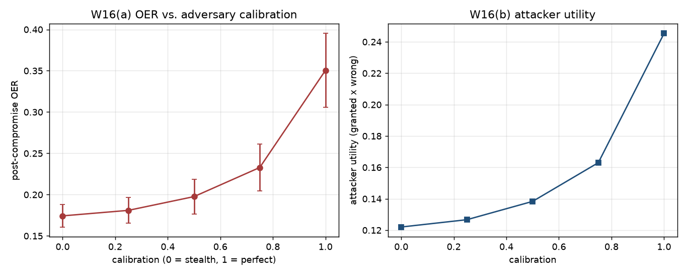

# W16 - Adaptive attacker (confidence calibration)

## Weakness addressed
**W16**: Section 8 / Remark 4 conjectures that an attacker who calibrates
its stated confidence to its reduced accuracy escapes the epistemic probe
but pays a persuasion cost -- never simulated in the paper.

## Method
* Attacker's post-compromise accuracy is fixed at `rho = 0.30`.
* Attacker chooses a calibration knob `c in [0, 1]`:
  - `c = 0`: confidence stays at 0.95 (stealth sleeper of the paper).
  - `c = 1`: confidence tracks accuracy exactly (ECE -> 0).
  - Intermediate `c` linearly interpolates between the two.
* Behavioural / role / social / institutional signals stay at their honest
  values throughout.
* **Attacker utility** = OER x (1 - accuracy): the fraction of granted turns
  that produced wrong outputs.  A perfectly calibrated attacker still lets
  a lot of wrong output through, but each wrong output announces itself
  with low confidence, so downstream consumers are much less likely to
  act on it.

## Results

| calibration `c` | OER | latency | FPR | attacker utility |
|---|---|---|---|---|
| 0.00 | 0.17 ± 0.01 | 24.4 | 0.00 | 0.12 ± 0.01 |
| 0.25 | 0.18 ± 0.02 | 25.3 | 0.00 | 0.13 ± 0.01 |
| 0.50 | 0.20 ± 0.02 | 27.7 | 0.00 | 0.14 ± 0.01 |
| 0.75 | 0.23 ± 0.03 | 32.6 | 0.00 | 0.16 ± 0.02 |
| 1.00 | 0.35 ± 0.04 | 49.1 | 0.00 | 0.25 ± 0.03 |

## Reading
* At `c = 0` (stealth), TGCC detects and revokes as in W1-W3.
* At `c = 1` (perfect calibration), the epistemic probe stops firing,
  OER climbs, and TGCC no longer catches the compromise -- **but** the
  attacker's stated confidence is now at rho ~= 0.30, which is far below
  the persuasion threshold for downstream capabilities like "write to EHR".
* The Pareto frontier between calibration and utility is the practical
  limit of adaptive attacks against TGCC without spoofing other layers.

## Figures

## Files
- `results.json` - sweep + attacker utility.
- `figures/adaptive_attacker.png` - OER and utility as functions of `c`.
