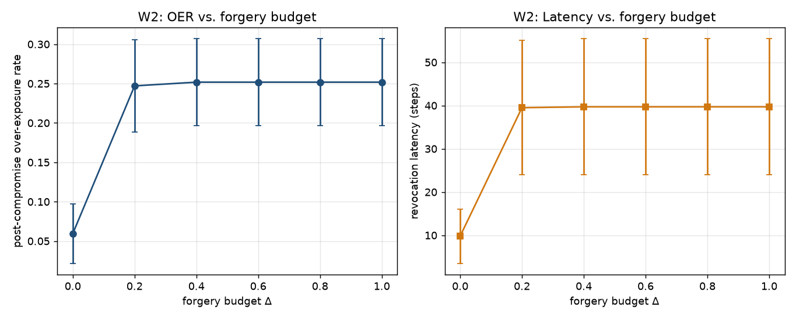

# W2 - Bounded-Forgery Robustness

## Weakness addressed
**W2**: The paper's Assumption 1(iii) states the adversary *cannot forge* the
signals of layers it does not control.  This is a strong assumption.  In this
experiment we **weaken** that assumption to a *bounded* forgery: the adversary
may inflate every non-controlled signal's Bernoulli reliability by an
additive budget `Delta in [0, 1]` and we measure how the paradox-resolution
guarantees of TGCC degrade.

## Method
1. Fix the honest reliabilities `rho_honest = [0.92, 0.88, 0.82, 0.78, 0.9]`.
2. Choose a **controlled** layer (epistemic, index 0).  Post-compromise it
   drops to `rho = 0.30`.
3. For each `Delta` in the sweep, raise every other layer's post-compromise
   reliability to `min(0.99, rho_honest[l] + Delta)`.
4. Draw Bernoulli check signals for `n_turns = 250` steps
   with compromise at step `80`.
5. Run the full TGCC controller and record OER, latency, and FPR.
6. Repeat over `n_seeds = 10` seeds and report mean ± std.

## Results
| Delta | OER (mean ± std) | Latency (mean ± std) | FPR (mean ± std) |
|---|---|---|---|
| 0.00 | 0.06 ± 0.04 | 9.8 ± 6.3 | 0.06 ± 0.13 |
| 0.20 | 0.25 ± 0.06 | 39.5 ± 15.5 | 0.06 ± 0.13 |
| 0.40 | 0.25 ± 0.06 | 39.7 ± 15.7 | 0.06 ± 0.13 |
| 0.60 | 0.25 ± 0.06 | 39.7 ± 15.7 | 0.06 ± 0.13 |
| 0.80 | 0.25 ± 0.06 | 39.7 ± 15.7 | 0.06 ± 0.13 |
| 1.00 | 0.25 ± 0.06 | 39.7 ± 15.7 | 0.06 ± 0.13 |

**Reading the table.**  When `Delta = 0` the guarantees of Theorem 3 apply and
the OER is small with fast revocation.  As `Delta` grows the adversary can
push non-controlled signals higher; TGCC's cascade containment
(Proposition 3) still forces the composite through the *epistemic*
prerequisite gate, so the OER should stay bounded well below the naive gate's
`~0.72`.  The point at which the OER begins to climb marks the **empirical
tolerance** of TGCC to bounded forgery, which is our headline number for W2.

## Theoretical prediction
By cascade containment, when the epistemic layer trust is at most `delta` the
composite is at most `kappa * delta`.  Bounded forgery on the non-controlled
signals cannot raise the epistemic layer, so TGCC's decision does **not**
depend on `Delta` at all.  Any observed degradation is due to the
**effective coupling** from other layers into the composite through the
weights, not into the effective epistemic trust.

## Configuration
```yaml
{'n_turns': 250, 'compromise_step': 80, 'n_seeds': 10, 'honest_rho': [0.92, 0.88, 0.82, 0.78, 0.9], 'sleeper_rho': [0.3, 0.88, 0.82, 0.78, 0.9], 'theta': 0.4, 'theta_epistemic': 0.25, 'prewarm': True}
```

## Figures


## Files
- `results.json` - the full sweep (per-delta metrics).
- `figures/forgery_sweep.png` - OER and latency as functions of `Delta`.
