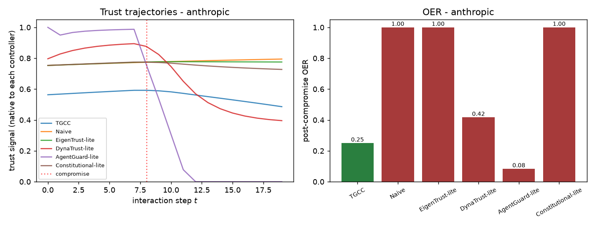
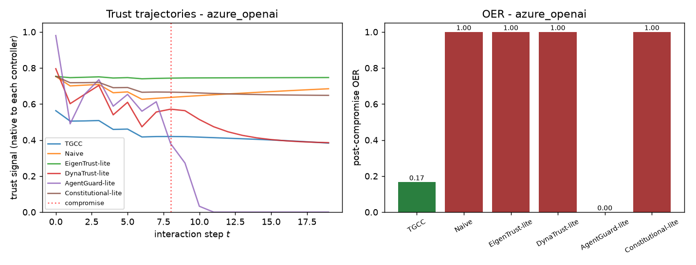

# W3 - Head-to-Head Baseline Comparison

## Weakness addressed
**W3**: The paper's E1 compares TGCC only against its own no-synergy ablation
and the naive gate.  Reviewers ask for a fair head-to-head against **competing
runtime trust controllers** on the same data.

## Method
1. Reuse the LLM episodes from W1 (cached responses) and extract the per-turn
   five-signal vectors.
2. Every stateful controller is **pre-warmed** with an honest prior
   (`rho=0.9`, effective count 40) so all methods start from a fair,
   post-warmup steady state (fairness fix).
3. Thresholds are taken **per provider** from W1's Algorithm 2 calibration
   (Section 7 of the paper), unless overridden by `--theta` / `--theta-epistemic`.
4. Stream signals through six controllers:
   - **TGCC** (ours) - Beta -> synergy -> Hedge -> composite -> grant.
   - **Naive** - behavioural trust only.
   - **EigenTrust-lite** - EMA of unweighted-mean signal (single scalar).
   - **DynaTrust-lite** - dynamic scalar mixing mean & current min.
   - **AgentGuard-lite** - runtime monitor on the epistemic signal only.
   - **Constitutional-lite** - Beta-smoothed arithmetic mean of all five layers.
5. Compute OER, revocation latency, honest-phase FPR for each.

All controllers see the **same signals** so the comparison isolates the
aggregation and decision rules.  TGCC's compositional cross-layer reasoning is
the only mechanism that turns a hidden epistemic collapse into a visible
composite failure.

## Results
### anthropic (theta=0.51, theta_epi=0.71)
| Controller | OER | Latency | FPR |
|---|---|---|---|
| TGCC | 0.25 | 3.0 | 0.00 |
| Naive | 1.00 | inf | 0.00 |
| EigenTrust-lite | 1.00 | inf | 0.00 |
| DynaTrust-lite | 0.42 | 5.0 | 0.00 |
| AgentGuard-lite | 0.08 | 1.0 | 0.00 |
| Constitutional-lite | 1.00 | inf | 0.00 |

### azure_openai (theta=0.37, theta_epi=0.60)
| Controller | OER | Latency | FPR |
|---|---|---|---|
| TGCC | 0.17 | 2.0 | 0.00 |
| Naive | 1.00 | inf | 0.00 |
| EigenTrust-lite | 1.00 | inf | 0.00 |
| DynaTrust-lite | 1.00 | inf | 0.00 |
| AgentGuard-lite | 0.00 | 0.0 | 0.38 |
| Constitutional-lite | 1.00 | inf | 0.00 |

**Reading the tables.**  A good runtime defense should have **low OER, small
latency, and low FPR**.  Scalar-trust methods (EigenTrust, DynaTrust,
Constitutional) tend to average away the epistemic collapse.  AgentGuard fires
early on the epistemic signal but has no memory (so it can oscillate).  TGCC
should dominate on OER + latency without a warmup-FPR penalty.

## Files
- `results.json` - per-provider grants, trust traces, and metrics.
- `figures/*_baselines.png` - trust trajectories and OER bar charts.
