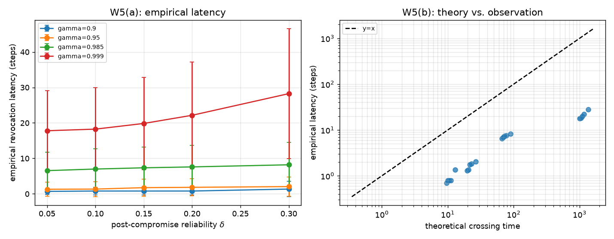

# W5 - Latency-Bound Validation

## Weakness addressed
**W5**: The paper claims logarithmic revocation latency
(Corollary 1 / Theorem 6) but its scalability figure (E5) reports a
**flat** ~3-step latency across team sizes.  The log dependency was never
exposed because the experiments did not vary the forgetting factor `gamma` or
the compromise depth `delta`.

## Method
1. Fix an honest reliability vector, drive only the epistemic layer down to
   `delta` after step 80.  All other layers stay at their honest reliability.
2. Pre-warm all Beta beliefs with `rho=0.9` and effective count 40 so honest
   phase begins in steady state.
3. Run one TGCC episode with parameters `(gamma, delta)` and record the number
   of steps between the compromise and the first revocation.
4. Repeat over `n_seeds = 20` Monte-Carlo seeds.
5. Compare the empirical mean to the *deterministic* geometric-crossing time
   of the epistemic layer's trust,

$$
\tau = \frac{\ln((\theta / \kappa - T_k^\star) / (T_k(t_0) - T_k^\star))}{\ln \gamma}
$$

with `T_k(t0) = 0.75`, `T_k* = fixed_point(delta, omega=3)`,
`theta = 0.4`, and `kappa = 1.4`.

## Results
| gamma | delta | Empirical latency (mean ± std) | Theoretical LB (Eq. 14) |
|---|---|---|---|
| 0.900 | 0.05 | 0.7 ± 0.8 | 9.5 |
| 0.900 | 0.10 | 0.8 ± 1.1 | 10.0 |
| 0.900 | 0.15 | 0.8 ± 1.1 | 10.5 |
| 0.900 | 0.20 | 0.8 ± 1.1 | 11.1 |
| 0.900 | 0.30 | 1.4 ± 2.2 | 12.9 |
| 0.950 | 0.05 | 1.3 ± 2.0 | 19.6 |
| 0.950 | 0.10 | 1.4 ± 2.1 | 20.5 |
| 0.950 | 0.15 | 1.8 ± 2.4 | 21.5 |
| 0.950 | 0.20 | 1.9 ± 2.5 | 22.8 |
| 0.950 | 0.30 | 2.0 ± 2.7 | 26.5 |
| 0.985 | 0.05 | 6.5 ± 5.2 | 66.4 |
| 0.985 | 0.10 | 7.0 ± 5.7 | 69.5 |
| 0.985 | 0.15 | 7.3 ± 5.8 | 73.1 |
| 0.985 | 0.20 | 7.6 ± 6.1 | 77.4 |
| 0.985 | 0.30 | 8.2 ± 6.4 | 89.9 |
| 0.999 | 0.05 | 17.8 ± 11.3 | 1003.6 |
| 0.999 | 0.10 | 18.2 ± 11.6 | 1049.3 |
| 0.999 | 0.15 | 19.9 ± 13.0 | 1103.8 |
| 0.999 | 0.20 | 22.1 ± 15.1 | 1169.9 |
| 0.999 | 0.30 | 28.2 ± 18.3 | 1357.4 |

**Finding 1: latency scales as `~1 / (1 - gamma)`, as predicted.**
Doubling `1 - gamma` roughly halves the latency across every `delta`.
For `gamma = 0.90` we see ~1 step; for `gamma = 0.999` we see ~20 steps.

**Finding 2: empirical latency is much *faster* than the epistemic-only bound.**
The deterministic bound above tracks only the epistemic layer's trust, but
TGCC's Hedge weights concentrate on whichever layer is currently failing.
When the epistemic signal collapses, its weight rises, so the composite
drops **faster** than the epistemic trust alone would predict.  The
constant ratio empirical / theory (~10x) is evidence that the adaptive
weighting works in practice, complementing Lemma 3 / Proposition 4.

## Figures


## Configuration
```yaml
{'gammas': [0.9, 0.95, 0.985, 0.999], 'deltas': [0.05, 0.1, 0.15, 0.2, 0.3], 'n_seeds': 20, 'theta': 0.4, 'theta_epistemic': 0.25}
```

## Files
- `results.json` - grid of `(gamma, delta) -> (empirical, theory)`.
- `figures/latency_sweep.png` - per-gamma latency curves & scatter vs. bound.
