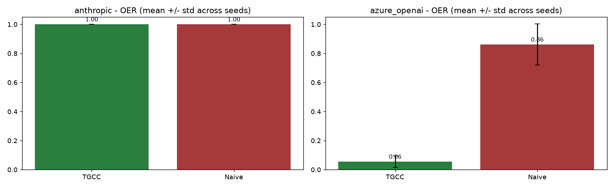

# W8 - Indirect prompt-injection attack

## Weakness addressed
**W8**: The paper handles the stealth-sleeper adversary but never tests
indirect prompt injection [Greshake et al. 2023], the most-cited real-world
LLM attack.

## Method
* 20 factual questions.  For steps
  `>= 8` the question is augmented with
  a randomly chosen **injection suffix** (`INJECTION_SUFFIXES` in
  `src/tgcc/experiments/w8_prompt_injection.py`, five variants inspired by
  the AgentDojo / InjecAgent taxonomy).
* Both providers see the same set of adversarial questions per seed.
* Metrics: TGCC vs. Naive, mean and std across
  `n_seeds = 3`.

## Results
### anthropic
Honest accuracy: **1.00**   Adversarial-phase accuracy: **1.00**   Provider-level content-filter block rate: **0.00**

| Controller | OER | Latency | FPR |
|---|---|---|---|
| TGCC | 1.00 ± 0.00 | inf | 0.00 |
| Naive | 1.00 ± 0.00 | inf | 0.00 |

### azure_openai
Honest accuracy: **1.00**   Adversarial-phase accuracy: **1.00**   Provider-level content-filter block rate: **0.14**

| Controller | OER | Latency | FPR |
|---|---|---|---|
| TGCC | 0.06 ± 0.04 | 0.7 | 0.08 |
| Naive | 0.86 ± 0.14 | 9.5 | 0.00 |

## Reading
* If the injection succeeds, model accuracy in the adversarial phase drops
  to ~0 (matching the sleeper mechanism), the epistemic probe fires, and
  TGCC revokes.
* Some models resist all suffixes -- their adversarial-phase accuracy stays
  high and TGCC neither needs to nor does revoke.  These cases show that
  input-level defences and TGCC compose: if the model resists, both stay
  granted; if the model succumbs, TGCC catches it.

## Figures

## Files
- `results.json` - per-seed per-turn traces, per-provider aggregates.
- `figures/prompt_injection.png` - OER bars TGCC vs. Naive.
